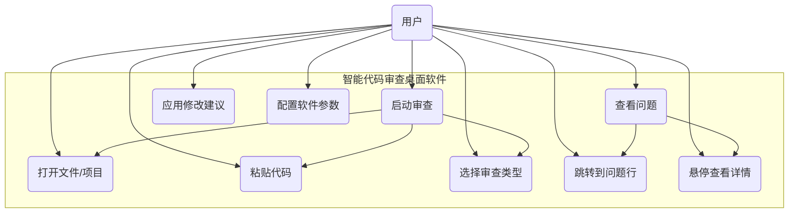

# 项目任务简报分析：基于RAG的智能代码审查辅助系统

## 1. 项目任务简报解读

### 1.1 任务概述
我的目的是开发一个**基于检索增强生成（Retrieval-Augmented Generation, RAG）的智能代码审查辅助系统**，以**桌面应用程序**的形式呈现。

我的想法是系统需能够接收用户提供的代码（单文件、文件夹或PR diff），利用大语言模型（LLM）自动发现潜在缺陷、逻辑错误和安全隐患，并给出修改建议。核心挑战在于处理大型代码文件时，LLM的上下文窗口限制，因此需引入RAG技术，将代码分块、索引并检索相关片段，再送入LLM进行精准分析。作为一个独立软件，它将不依赖特定IDE，可跨平台使用，更适合演示和交付。

### 1.2 背景与意义
代码审查是保障软件质量的关键环节，但传统人工审查耗时且容易遗漏深层问题。现有静态分析工具（如SonarQube、FindBugs）基于预定义规则，难以理解代码的业务语义和逻辑漏洞。近年来，大语言模型展现出强大的代码理解能力，但受限于有限的上下文窗口（通常为4K-32K tokens），无法直接处理大型代码文件或整个PR。RAG技术通过将代码库分割为语义完整的块，建立向量索引，就可以在审查时动态检索相关上下文，这样既突破了窗口限制，又保证了分析的精准性。我创建本项目的意义在于探索RAG在代码审查领域的应用，为开发者提供高效、智能的辅助工具，同时保护代码隐私（通过本地部署LLM）。以桌面应用程序形式实现，用户无需安装特定IDE，开箱即用，更符合毕设的独立性和完整性要求。

### 1.3 核心挑战
- **代码分块策略**：如何保证分块后代码块语义完整，同时便于检索。
- **检索准确性**：如何从大量块中准确召回与当前审查点相关的上下文。
- **LLM生成质量**：如何设计提示词使LLM输出结构化、可操作的审查意见。
- **桌面GUI设计**：如何提供直观的代码编辑、结果展示和交互体验。

---

## 2. 初始功能性和非功能性需求及初步顶层用例模型

### 2.1 功能性需求

| 需求ID | 需求描述 |
|--------|----------|
| F01 | **代码输入**：用户可通过打开文件、粘贴代码、拖拽文件或选择文件夹提交代码。支持单文件及PR diff格式。 |
| F02 | **语言识别**：系统自动根据文件扩展名识别编程语言（至少支持Python、Java、JavaScript），或允许用户手动选择。 |
| F03 | **审查类型**：用户可选择审查重点（安全审查、性能审查、全面审查），系统据此调整检索和提示词。 |
| F04 | **RAG检索**：系统自动将代码分块、建立向量索引，并根据用户请求检索相关代码块。 |
| F05 | **LLM审查**：将用户代码与检索到的上下文组合，调用本地LLM生成审查意见。 |
| F06 | **结果展示**：在主界面中分栏显示：代码编辑器（带行号、语法高亮）、问题列表（行号、风险等级、描述、建议）、点击问题列表可跳转到编辑器对应行、代码编辑器内高亮问题行，悬停显示详情（类似IDE体验） |
| F07 | **建议应用**：用户可选择应用建议代码（弹出预览窗口，确认后替换）。 |
| F08 | **项目管理**：支持打开整个项目文件夹，对项目内所有文件进行索引和批量审查。 |

### 2.2 非功能性需求

| 需求ID | 需求描述 | 
|--------|----------|
| NF01 | **响应时间**：单文件审查平均响应时间不超过10秒（含检索和LLM生成）。 |
| NF02 | **可扩展性**：系统应易于添加新语言支持或替换LLM模型。 | 
| NF03 | **隐私保护**：所有处理在本地完成，代码不上传至公有云。 | 
| NF04 | **易用性**：界面简洁直观，无需培训即可使用。 | 
| NF05 | **准确性**：审查结果应具有一定实用价值，召回率/精确率需通过人工评估验证。 | 
| NF06 | **资源占用**：在普通个人电脑（16GB内存，无GPU）上可运行，CPU模式下响应时间可适当放宽。 |

### 2.3 初步顶层用例模型（Mermaid）

**用例说明**：
- **打开文件/项目**：通过文件对话框选择单个文件或文件夹，软件自动加载并准备索引。
- **粘贴代码**：用户可快速粘贴代码片段进行临时审查。
- **选择审查类型**：在审查前可选择安全、性能或全面审查模式。
- **启动审查**：触发后端RAG流程，界面显示加载状态。
- **查看问题**：结果展示区列出所有问题，点击可跳转编辑器对应行。
- **悬停查看详情**：鼠标悬停在代码高亮行时弹窗显示问题描述和建议。
- **应用修改建议**：支持预览并确认后自动替换代码。
- **配置软件参数**：用户可自定义模型路径、检索块数量、忽略文件等。

---

## 3. 为明确简报而收集的信息

### 3.1 类似问题研究
通过调研现有代码审查工具和技术，发现：
- **SonarQube/SonarLint**：基于规则，无法理解逻辑漏洞，误报率高。
- **CodeQL**：需编写查询，学习成本高，适合深度定制。
- **DeepCode/Snyk**：基于机器学习，但为云端服务，代码需上传，存在隐私风险。
- **Amazon CodeGuru**：商业产品，依赖AWS生态。
- **GitHub Copilot**：代码生成工具，不专注审查，且云端处理。
- **CodeRabbit**：AI审查商业产品，用于PR评论，非IDE集成。

**结论**：现有工具要么依赖云端，要么规则死板。本地化、轻量级、结合RAG的桌面代码审查软件仍是空白，本课题具有创新性和实用价值。

### 3.2 背景研究
- **RAG在代码领域**：论文如“CodeReviewer”和“RepoQA”证明了RAG可提升代码理解与审查效果。分块策略通常采用AST（抽象语法树）拆分，保证语义完整性。
- **嵌入模型选择**：CodeBERT（125M参数）、UniXcoder等可在消费级硬件运行，适合本地部署。
- **LLM本地部署**：Ollama支持多种模型（CodeLlama、DeepSeek-Coder），量化后可降低资源需求。
- **向量数据库**：Chroma轻量级嵌入式，适合单机使用。
- **桌面GUI框架**：Electron（Web技术跨平台）或PyQt（原生体验）均可考虑。

### 3.3 信息来源
- 学术数据库：IEEE Xplore、ACM DL、arXiv.org。
- 技术社区：Stack Overflow、GitHub、Medium。
- 官方文档：FastAPI、Ollama、Chroma、Electron等。
- 行业报告：ThoughtWorks技术雷达。

---

## 4. 项目任务的目标

### 4.1 总体目标
构建一个**基于RAG的智能代码审查辅助系统（桌面应用程序）**，实现对单文件、文件夹及PR diff的自动审查，帮助开发者发现潜在缺陷，提升代码质量，同时保护代码隐私。

### 4.2 具体目标
1. **核心功能实现**：完成代码输入、RAG检索、LLM审查、结果展示全流程。
2. **支持语言**：至少支持Python、Java、JavaScript三种主流语言。
3. **大文件处理**：能够处理超过LLM上下文窗口的代码文件（如2000行以上）。
4. **本地部署**：所有组件可在个人电脑上运行，无需联网（除首次下载模型外）。
5. **用户体验**：提供友好的桌面GUI，代码编辑器带语法高亮、行内标注、问题悬停、跳转等功能。
6. **实验评估**：构建测试集，评估检索准确率和审查结果质量，验证系统有效性。

### 4.3 预期成果
- 可运行的桌面应用程序（含后端服务及GUI）
- 毕业设计论文（包含需求分析、设计、实现、测试、总结）
- 演示视频及用户手册
- 安装包（如.exe、.dmg、.AppImage）

---

## 5. 确定所需资源和材料以及如何获取/获得它们

### 5.1 开发环境

| 资源 | 规格/版本 |
|------|-----------|
| 操作系统 | Windows 10/11 / Ubuntu 20.04+ | 
| CPU | 4核以上，推荐Intel i5/AMD Ryzen 5+ | 
| 内存 | 16GB以上 | 
| GPU（可选） | NVIDIA GTX 1060 6GB+（用于加速LLM） |
| 硬盘空间 | 50GB以上（用于存放模型和数据库） | 
| 代码编辑器 | VS Code |
| 版本控制 | Git | 

### 5.2 软件库与框架

| 类别 | 名称 |  用途 |
|------|------|------|
| 后端框架 | FastAPI |  构建REST API（用于进程间通信） | 
| ASGI服务器 | Uvicorn |  运行后端 | 
| 代码解析 | Tree-sitter |  AST分块 | 
| 嵌入模型 | Sentence-Transformers |  生成向量 | 
| 向量数据库 | ChromaDB | 存储检索 | 
| LLM服务 | Ollama |  运行本地模型 | 
| 桌面GUI | Electron / PyQt5 | 最新版 | 跨平台桌面应用（Web技术）/ Python原生GUI | 
| 代码编辑器组件 | Monaco Editor / QScintilla|  嵌入代码编辑器（Electron）/ PyQt的代码编辑组件 |  
| 打包工具 | electron-builder / PyInstaller |  打包Electron应用 / 打包Python应用| 

### 5.3 数据集

| 数据用途 | 来源 | 
|----------|------|
| 代码分块测试 | GitHub开源项目（如spring-petclinic, flask） | 
| 审查效果评估 | 人工构造的缺陷代码（空指针、死锁、SQL注入等） | 
| 真实PR数据 | 开源项目的历史PR（含缺陷修复） | 

---

## 6. 确定将要使用的信息来源

### 6.1 学术文献数据库
- **IEEE Xplore**：搜索关键词 "code review", "RAG", "large language model", "code analysis"。
- **ACM Digital Library**：关注软件工程顶会（ICSE, FSE, ASE）相关论文。
- **arXiv.org**：获取最新预印本，如 "CodeReviewer"、"RepoQA" 等。
- **Google Scholar**：追踪引用网络，发现经典文献。

### 6.2 技术社区与博客
- **Stack Overflow**：解决开发中遇到的具体技术问题。
- **Medium/Dev.to**：搜索 "RAG code review" 等实践文章。
- **官方文档**：FastAPI、Electron、PyQt、Ollama 等官方文档是权威参考。
- **GitHub**：查阅类似开源项目（如 CodeGeeX、CodeSearchNet）的代码和讨论，以及桌面应用示例。

### 6.3 行业报告
- **ThoughtWorks 技术雷达**：了解AI辅助开发工具的最新趋势。
- **Gartner 报告**：获取代码质量工具的市场分析。

### 6.4 课程与教材
- **软件工程**：参考代码审查流程、需求分析等基础知识。
- **机器学习/NLP**：理解Transformer、RAG原理。
- **桌面开发**：学习Electron或PyQt教程。

