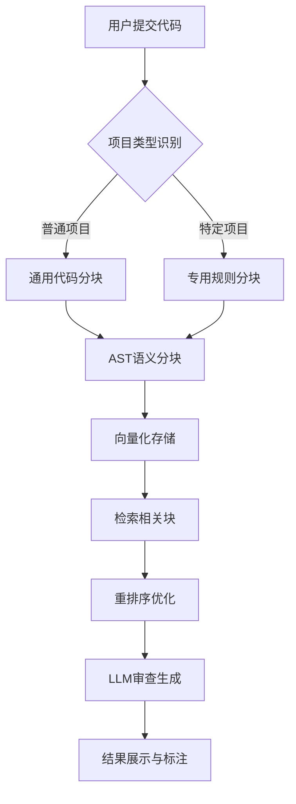
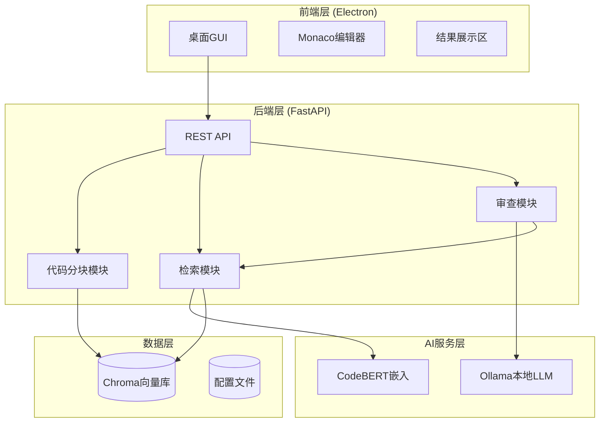
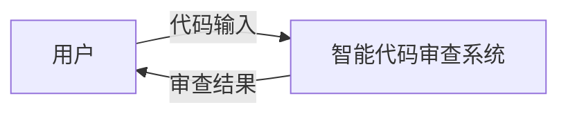
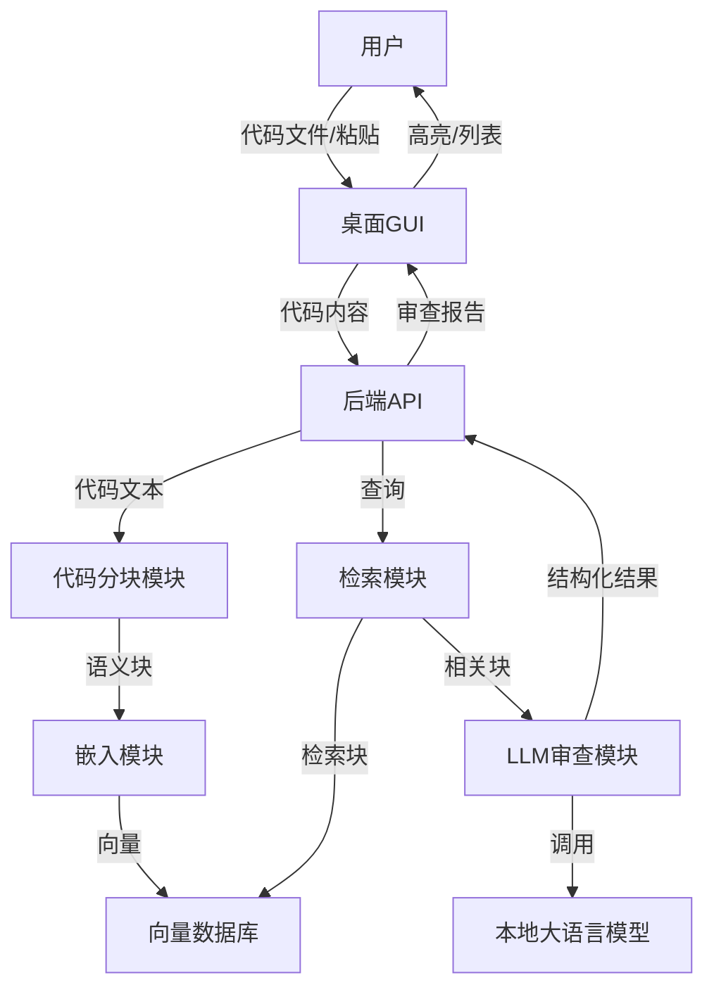
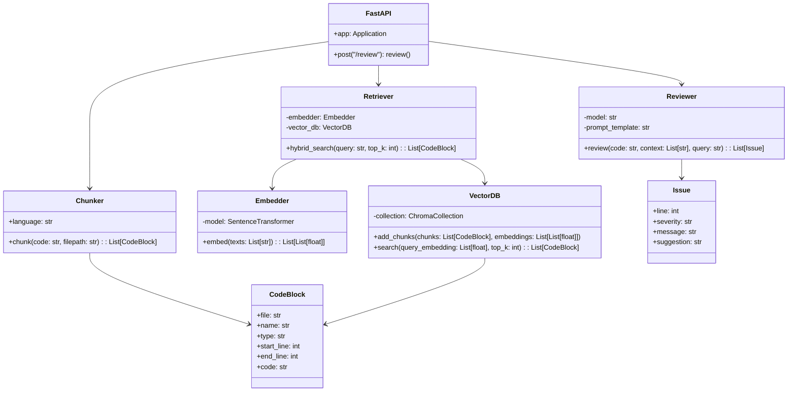
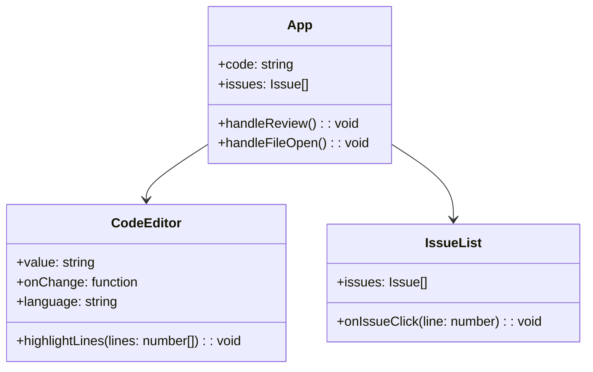

# 解决方案计划：基于RAG的智能代码审查辅助系统

## 1. 问题分析

### 1.1 代码审查的核心挑战

基于对现有技术方案的调研和分析，智能代码审查系统面临以下核心挑战：

| 挑战维度 | 问题描述 | 技术影响 |
|---------|----------|----------|
| **上下文窗口限制** | 大语言模型通常只有4K-128K的上下文窗口，无法直接处理大型代码文件（如2000行以上） | 直接截断会导致关键信息丢失，审查深度受限 |
| **代码语义完整性** | 简单按行数截断会破坏函数、类等语义单元，使模型无法理解完整逻辑 | 导致审查结果碎片化，无法发现跨函数的逻辑缺陷 |
| **项目特定知识缺失** | 通用LLM不了解项目的架构设计、编码规范和历史模式 | 生成的审查意见泛泛而谈，缺乏针对性 |
| **检索准确性** | 从大量代码块中召回与当前变更真正相关的上下文难度大 | 召回的上下文不相关，反而干扰模型判断 |
| **知识归纳失真** | 对代码变更进行总结时，LLM可能遗漏或曲解关键上下文 | 后续流程建立在不完整的信息基础上，导致误报漏报 |

### 1.2 现有方案的局限性

通过对京东云、Arm、PayPay等企业的实践调研，发现当前主流方案存在以下问题：

**技术1：基于流水线的AI代码评审方案**
- 采用固定行数截断（如仅取变更处附近10行），完全丧失项目架构视野
- 所有评审规则硬编码于Prompt中，规则膨胀后触及上下文上限
- 效果提升依赖更换模型和调整Prompt，缺乏知识沉淀机制

**技术2：基于RAG的通用检索方案**
- 知识归纳步骤不稳定，经常遗漏关键上下文
- 未对检索结果进行重排序，召回的规则与真实代码场景匹配度低
- 缺乏项目身份感知能力，无法针对特定项目类型（如EDI配置）使用专用规则

**技术3：传统静态分析工具（SAST）**
- 基于规则的模式匹配，无法理解代码的业务意图
- 对逻辑漏洞和设计缺陷检测能力有限，误报率高
- 无法提供自然语言的解释和修改建议

### 1.3 解决方案设计原则

基于上述分析，本系统的设计遵循以下原则：

1. **语义完整性优先**：代码分块必须在函数、类等自然边界处进行，保证语义单元完整
2. **多级检索增强**：结合项目类型识别、语义相似度搜索和重排序，提高上下文相关性
3. **本地化部署**：所有处理在本地完成，保护代码隐私
4. **轻量级实现**：支持在普通个人电脑（16GB内存，无GPU）上运行
5. **可扩展架构**：易于添加新语言支持或替换LLM模型

## 2. 技术选型分析

### 2.1 代码分块策略选型

| 分块策略 | 优点 | 缺点 | 适用场景 | 选择决策 |
|---------|------|------|----------|----------|
| **基于AST的拆分**: | 按函数/类拆分，语义完整 | 需要语言解析器，实现较复杂 | 生产级系统 | 核心策略 |
| **混合拆分**: | 先AST拆分，超大函数再滑动 | 实现复杂，但平衡完整性和可控性 | 大型代码库 | 辅助策略 |

**选择理由**：
- 京东云的实践表明，在方法或类的自然边界处进行分割，能最大限度保持代码块的语义完整性
- Qodo的工程实践证实，使用语言特定的静态分析实现分块，可以避免向LLM提供无效或不完整的代码段
- 学术研究也支持基于AST的拆分策略，认为语义完整的代码块能显著提升检索效果

### 2.2 嵌入模型对比与选型

| 模型 | 参数量 | 特点 | 硬件要求 | 选择决策 |
|------|--------|------|----------|----------|
| **CodeBERT** | 125M | 代码专用，效果均衡 | 8GB内存 |  主选 |
| **UniXcoder** | 125M | 支持多语言 | 8GB内存 | 备选 |
| **Qodo-Embed-1-7B** | 7B | SOTA精度，代码优化 | 16GB显存 | 备选（有GPU时） |

**选择理由**：
- 代码特定的嵌入模型能更好地理解语法、变量依赖和API使用等代码元素
- CodeBERT（125M）可在消费级硬件运行，适合本地部署
- PayPay的实践使用text-embedding-ada-002，但本项目强调本地化，故选择开源模型

### 2.3 向量数据库对比与选型

| 数据库 | 优点 | 缺点 | 选择决策 |
|--------|------|------|----------|
| **Chroma** | 轻量级嵌入式，Python集成简单，适合POC | 大规模扩展性有限 |  主选 |
| **FAISS** | 高效相似搜索，Meta出品 | 需要自行管理持久化 | 备选 |
| **Qdrant** | 功能丰富，有本地模式 | 相对较重 | 备选 |

**选择理由**：
- PayPay的实践评估了多种向量数据库，最终选择Chroma用于其低成本和高易用性
- Chroma嵌入式设计无需单独部署服务，适合桌面应用
- 毕设规模下，Chroma完全满足性能需求

### 2.4 LLM本地部署方案对比

| 方案 | 优点 | 缺点 | 选择决策 |
|------|------|------|----------|
| **Ollama** | 一键安装，支持多模型，API兼容 | 需单独下载模型 |  主选 |
| **llama.cpp** | 纯CPU可运行，支持量化 | 使用稍复杂 | 备选（无GPU时） |

**模型选择**：
- 主选：**DeepSeek-Coder-6.7B**（中文支持好，代码专项优化）
- 备选：**CodeLlama-7B**（Meta出品，社区活跃）
- 备选：**Qwen2.5-Coder-7B**（阿里出品，中文友好）

**选择理由**：
- 学术研究显示，7B级别模型在代码审查任务中表现强劲
- 可通过4-bit量化将显存需求降至8GB以内，适合普通个人电脑
- DeepSeek-Coder在多项代码任务中表现优异

### 2.5 桌面GUI框架对比

| 框架 | 优点 | 缺点 | 选择决策 |
|------|------|------|----------|
| **Electron** | 跨平台，Web技术栈，社区活跃 | 打包体积较大 |  主选 |
| PyQt5 | Python原生，性能好 | 界面开发较复杂 | 备选 |

**选择理由**：
- Electron可使用Monaco Editor（VS Code编辑器核心），提供专业代码编辑体验
- Web技术栈便于快速开发和迭代

## 3. 原型应用的分析与设计证据

### 3.1 核心流程设计

基于对现有成功案例的分析，系统核心流程设计如下：

**设计证据**：
- 京东云的双RAG架构证实，项目类型识别能显著提升检索针对性
- Qodo的实践表明，AST语义分块比朴素分块能更准确描绘有意义的代码片段
- Arm的Metis项目使用类似架构，在内部测试中达到95%的真阳性率

## 4. 架构设计证据

### 4.1 系统架构图

### 4.2 数据流设计

1. **代码输入**：用户打开文件或粘贴代码
2. **分块索引**：
   - 解析AST，提取函数/类单元
   - 生成CodeBERT嵌入
   - 存储至Chroma向量库
3. **审查触发**：
   - 用户点击"开始审查"
   - 系统构建查询（当前代码+审查类型）
4. **检索**：
   - 混合检索获取相关块
   - 重排序优化结果
5. **LLM生成**：
   - 组合提示词（检索上下文+代码+指令）
   - 调用Ollama本地模型
   - 解析JSON输出
6. **结果展示**：
   - 更新问题列表
   - 编辑器内高亮
   - 支持跳转和应用建议

**设计证据**：
- PayPay的实践显示，初始化47个历史事件的嵌入仅需$0.001852
- MDPI的研究表明，DeepSeek-Coder-33B在检索深度k=3时对齐分数提升17.9%
- Arm的Metis在内部测试中达到95%的真阳性率

## 数据流图

### 顶层图（上下文图）

### 0层图（核心处理流程）

**数据流说明**：
1. 用户通过GUI输入代码（打开文件/粘贴）。
2. GUI将代码发送至后端API。
3. 后端API触发代码分块模块，将代码拆分为语义块（函数/类）。
4. 嵌入模块为每个块生成向量，存入向量数据库（Chroma）。
5. 检索模块根据用户代码或查询，从向量数据库检索相关块（混合检索+重排序）。
6. 审查模块将检索到的块与原代码组合成提示词，调用本地LLM（Ollama）生成审查意见。
7. 审查结果返回给GUI，GUI在编辑器中高亮问题行并显示问题列表。

---

## 类图

### 后端核心类

### 前端主要组件（简化）

**类关系说明**：
- 后端采用分层设计：API层调用分块、检索、审查三大模块。
- `Chunker`负责将代码拆分为`CodeBlock`对象。
- `Embedder`生成向量，`VectorDB`负责存储和检索，`Retriever`封装混合检索逻辑。
- `Reviewer`调用LLM并返回`Issue`列表。
- 前端`App`组件管理状态，`CodeEditor`显示代码并支持高亮，`IssueList`展示问题并支持跳转。

